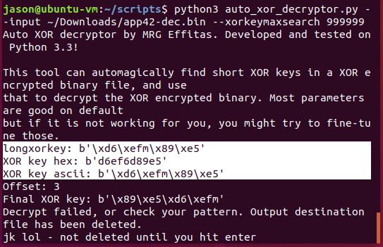
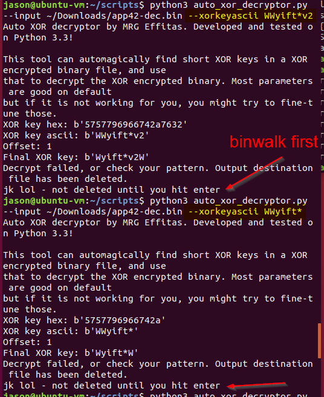
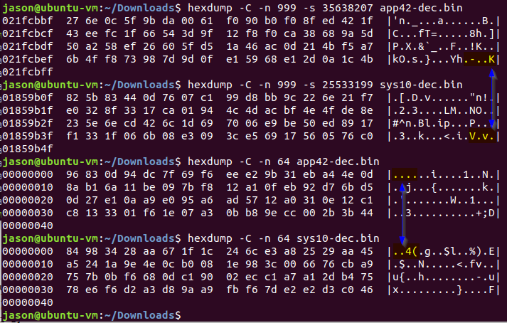

# fw9900Pv3

The .bin files in the v42 app package both appear to be OpenSSL encrypted:

```
jason@ubuntu-vm:~/Downloads$ binwalk Step*

Scan Time:     2018-10-18 10:05:38
Target File:   /home/jason/Downloads/Step1_FosIPC_F_sys_ver1.11.1.10.bin
MD5 Checksum:  da5bded4eb498b75800d324c05384b36
Signatures:    344

DECIMAL       HEXADECIMAL     DESCRIPTION
--------------------------------------------------------------------------------
0             0x0             OpenSSL encryption, salted, salt: 0x-105B34CE19C0A315


Scan Time:     2018-10-18 10:05:40
Target File:   /home/jason/Downloads/Step2_FosIPC_F_app_ver2.x.1.42.bin
MD5 Checksum:  333c5abed872d494f359f2702d5743ee
Signatures:    344

DECIMAL       HEXADECIMAL     DESCRIPTION
--------------------------------------------------------------------------------
0             0x0             OpenSSL encryption, salted, salt: 0x-AFC48296B6583E7
18745355      0x11E080B       MySQL MISAM compressed data file Version 7
```

# Decrypting original .bin's

### Step2_FosIPC_F_app_ver2.x.1.42.bin

Decrypted output file:
* Algorithm : MD5
* Hash      : FBC67F2AB8309D4E7E243CDA80975FC3

I'm pretty sure that "WWyift*" is the aes-128-cbc key for Step2_FosIPC_F_app_ver2.x.1.42.bin, based on the fact that it was the only key that didn't die with a "bad decrypt" error. HOWEVER, I don't know what the output file is. And it's bedtime so I'm not going to look any more into it ;)

Uploading it here for reference, though!
(I had to split it in 2 parts to get around the filesize upload restriction. I used 7zip but I think you can combine with just about anything, including `cat app42-dec.bin* > app42-dec.bin`.)

```
C:\>openssl enc -d -aes-128-cbc -in Step2_FosIPC_F_app_ver2.x.1.42.bin -out test.bin -md md5 -k Wyift*v2
bad decrypt
43136:error:06065064:digital envelope routines:EVP_DecryptFinal_ex:bad decrypt:.\crypto\evp\evp_enc.c:531:

C:\>openssl enc -d -aes-128-cbc -in Step2_FosIPC_F_app_ver2.x.1.42.bin -out test.bin -md md5 -k WWyift*

C:\>openssl enc -d -aes-128-cbc -in Step2_FosIPC_F_app_ver2.x.1.42.bin -out test_b.bin -md md5 -k WWyift*v2
bad decrypt
47996:error:06065064:digital envelope routines:EVP_DecryptFinal_ex:bad decrypt:.\crypto\evp\evp_enc.c:531:
```

UNFORTUNATELY the decrypted file is, itself, enciphered somehow :'-O

```
jason@ubuntu-vm:~/Downloads$ cat test.bin* > test.bin
jason@ubuntu-vm:~/Downloads$ md5sum test.bin
fbc67f2ab8309d4e7e243cda80975fc3  test.bin
jason@ubuntu-vm:~/Downloads$ file test.bin
test.bin: data
jason@ubuntu-vm:~/Downloads$ binwalk test.bin

DECIMAL       HEXADECIMAL     DESCRIPTION
--------------------------------------------------------------------------------

```

Binwalk gives nothing (obvious) on the output file, even though the input files were correctly ID'd.

Moving on to the other file, for now...

### Step1_FosIPC_F_sys_ver1.11.1.10.bin

Again, the decrypted output file is binary gibberish. This time, the decryption key was slightly different: "WWyift*v2". Kinda interesting that the step 1 file key uses the (step2 key)+(v2) and not the other way around.

Decrypted output file:
* Algorithm : MD5
* Hash      : b5dfe29f046caf6ab19ad4262935778a

```
jason@ubuntu-vm:~/Downloads$ openssl enc -d -aes-128-cbc -in Step1_FosIPC_F_sys_ver1.11.1.10.bin -out test2.bin -md md5 -k WWyift*v2
jason@ubuntu-vm:~/Downloads$ binwalk test2.bin

DECIMAL       HEXADECIMAL     DESCRIPTION
--------------------------------------------------------------------------------

```

More gibberish. Awesome.

# Decrypted files are indecipherable gibberish.  (...?)

### Maybe XOR'd using a key-less algorithm?

The decrypted files are BOTH enciphered somehow :'-O

It would have been too easy if the same key and openssl worked again, but no.

So if these intermediate output file's aren't simple .tgz archives like the C1's decrypted output... maybe they're XOR enciphered like the C1's recover_image.bin? 

I also XOR'd them as was necessary for the C1 recover_image.bin but the resulting file was also gibberish.

But-- there are lots of ways to twiddle bytes in XOR algorithms, that's certainly still on the table. Unfortunately again, I threw 6-8 (non-key) XOR'ing algorithms at at it. I threw it through 5 successive runs of the algorithm that cracked the recover_image.bin, just in case. All gibberish, unrecognized as anything realistic by binwalk.

### Maybe XOR'd using a (repeating) key?

So... though Foscam munged the C1 recover_image.bin with a basic keyless XOR algorithm, it doesn't look like any basic algorithm is at play here, if it even is XOR'd. I did some limited checking with [the automatic XOR decryptor tool](http://seclist.us/automatic-xor-decryptor-tool.html) to see if it could smell out an XOR cipher stream with a rotating key... or at least I used the tool to see if such a key might be obviously findable. 



The best repeating key sequence it could find was only 5 bytes long which seems an unlikely candidate, in any rotation.

It's my understanding that (with defaults) such a tool works only if the enciphered file has long strings of repeated bytes (ideally zeroes) such that ID'ing a pattern is possible, so this doesn't necessarily mean they didn't do it, just that the original file had unworkable entropy.

Of course the most obvious choice of key, if they were going to do it that way, would be to use the same key(s) that unlocked the original firmware .bin(s).



I don't think that tool will try all rotations/reflections/etc of the provided key. I'm pretty sure it just starts from byte-0 and stream-XORs to the end. It looks like you can provide the specific offset you want, but I'm not going to do that since I think it's barking up the wrong tree.

### Grasping at straws

Putting some thought into it, deciphering XOR "encryption" kinda depends on finding patterns (which hasn't panned out) or knowing what's supposed to already exist... 

I DO actually POTENTIALLY know something about the files. I expect them to be roughly the same as what I found in the Foscam C1 firmware: so either .tgz (aka .gz) or .squashfs archives. Aaaand one would expect both the sys and the app packages would be of the same type, since clearly Foscam's software can't determine the type of install by looking at the file, otherwise they wouldn't need "Step1" and "Step2" for the files.  So shouldn't the magic bytes match?



Thus it's kinda interesting that the files don't resemble each other in any way: neither the top or bottom of the files match!?

This once again indicates maybe there's a key to the XOR cipher. But like we just concluded, Foscam's firmware handler can't "see" what file is what, so could it be independantly choosing a key? It seems unlikely (though not impossible -- it could just be trying a smallish set of keys to see what sticks, even though that seems awfully inefficient).  

Soooo it's indepentantly deciphering different files, treating them differently? To effectively treat input differently, it must have some way of deciding HOW to treat it differently. Some OTHER identifying information.  .........file size? md5? something like that???
